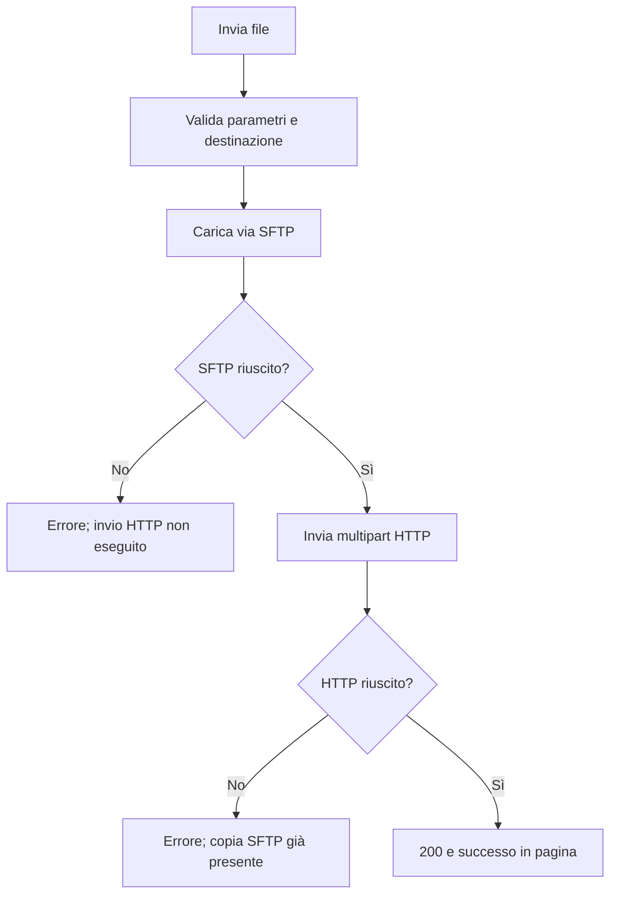

# CreazioneListe

Applicazione MVC/API per generare liste operative dalle pratiche presenti in SQL Server. Supporta la selezione delle lavorazioni, la produzione di file Excel, la registrazione delle esportazioni e l'invio dei documenti, mantenendo separati TENANT_A e TENANT_B.

| Aspetto | Descrizione |
| --- | --- |
| Utilizzatore | Operatore e client di integrazione |
| Punto di ingresso | Interfaccia MVC e API REST |
| Risultato | Liste Excel, archivi ZIP, registro SQL e copie remote |

## Indice

- [Funzionalità](#funzionalità)
- [Tecnologie e requisiti](#tecnologie-e-requisiti)
- [Configurazione](#configurazione)
- [Avvio](#avvio)
- [Flussi operativi](#flussi-operativi)
- [Verifiche](#verifiche)
- [Struttura e documentazione](#struttura-e-documentazione)

## Funzionalità

- Consultazione dei gruppi per fornitore, accertamento e urgenza.
- Selezione e unione delle lavorazioni da esportare.
- Generazione di tracciati Excel specifici per servizio.
- Download dei file e consultazione del registro delle esportazioni.
- Invio sequenziale tramite SFTP e integrazione HTTP.

## Tecnologie e requisiti

ASP.NET Core MVC/API su **.NET 8**, SQL Server, Microsoft.Data.SqlClient, EPPlus per Excel, SSH.NET per SFTP, Serilog e Swagger.

Servono il .NET SDK compatibile con `net8.0`, un database SQL Server con lo schema previsto e cartelle scrivibili per gli output. SFTP e integrazione HTTP servono solo per le relative funzionalità.

## Configurazione

I comandi seguenti si eseguono dalla radice del repository. Le impostazioni riservate vanno in User Secrets durante lo sviluppo o nelle variabili d'ambiente del processo.

| Chiave | Utilizzo |
| --- | --- |
| `ConnectionStrings:DefaultConnection_TENANT_A` | Database del primo tenant |
| `ConnectionStrings:DefaultConnection_TENANT_B` | Database del secondo tenant |
| `Paths:TENANT_A`, `Paths:TENANT_B` | Directory di lavoro dei file |
| `Sftp:Host`, `Sftp:Port`, `Sftp:Username`, `Sftp:Password` | Connessione SFTP; porta predefinita 22 |
| `Integrations:UploadUrl` | Endpoint HTTP che riceve i file |
| `QueryFilters:ExcludedClientCodes` | Elenco facoltativo dei codici cliente da escludere |
| `QueryFilters:MandanteSupplierCode` | Codice fornitore per la regola della colonna Mandante |
| `Exports:Operator` | Valore facoltativo dell'operatore negli export |

Esempio di configurazione locale in PowerShell, con database dimostrativi e autenticazione Windows:

~~~powershell
dotnet user-secrets set --project CreazioneListe/CreazioneListe.csproj "ConnectionStrings:DefaultConnection_TENANT_A" "Server=(localdb)\MSSQLLocalDB;Database=ListeDemoA;Trusted_Connection=True;"
dotnet user-secrets set --project CreazioneListe/CreazioneListe.csproj "ConnectionStrings:DefaultConnection_TENANT_B" "Server=(localdb)\MSSQLLocalDB;Database=ListeDemoB;Trusted_Connection=True;"
dotnet user-secrets set --project CreazioneListe/CreazioneListe.csproj "Paths:TENANT_A" "C:\demo\liste\tenant-a"
dotnet user-secrets set --project CreazioneListe/CreazioneListe.csproj "Paths:TENANT_B" "C:\demo\liste\tenant-b"
~~~

Creare le cartelle e predisporre i database prima di utilizzare le funzioni. Per le variabili d'ambiente sostituire `:` con `__`; un elemento di un array si indica, ad esempio, con `QueryFilters__ExcludedClientCodes__0`.

### Contratto del database

[database/schema.sql](database/schema.sql) contiene uno schema dimostrativo vuoto. Definisce nomi generici coerenti, tra cui `Pratiche`, `Assegnazioni`, `Fornitori`, `TipiAccertamento`, `Soggetti` e `RegistroFile`.

Lo script non viene eseguito automaticamente e non è una migrazione di un database esistente. Per dati reali, predisporre tabelle o viste compatibili con il contratto del servizio; tenere gli adattatori specifici e i dati fuori dal repository.

## Avvio

~~~powershell
dotnet restore CreazioneListe.sln
dotnet build CreazioneListe.sln
dotnet run --project CreazioneListe/CreazioneListe.csproj --launch-profile CreazioneListe
~~~

Aprire `https://localhost:7255`; il profilo espone anche `http://localhost:5030`. In sviluppo la documentazione API è disponibile su `/swagger`. Per HTTPS locale, configurare il certificato di sviluppo con `dotnet dev-certs https --trust`.

## Flussi operativi

I flussi descrivono il comportamento implementato, inclusi gli effetti parziali e le automazioni non attive. La ricostruzione si basa sull'analisi statica dei sorgenti dell'8 ottobre 2026; le verifiche proposte non costituiscono test già eseguiti.

### Indice dei flussi

- [Contesto operativo](#contesto-operativo)
- [Consultazione dei gruppi](#consultazione-dei-gruppi)
- [Generazione dei file selezionati](#generazione-dei-file-selezionati)
- [Download locali e registro](#download-locali-e-registro)
- [Invio esterno: SFTP seguito da HTTP](#invio-esterno-sftp-seguito-da-http)
- [API e consultazione SFTP](#api-e-consultazione-sftp)
- [Errori, automazioni e fine del ciclo](#errori-automazioni-e-fine-del-ciclo)

### Contesto operativo

L'operatore usa l'interfaccia MVC; un'integrazione può usare le API. Prima delle operazioni devono esistere database, percorsi dei tenant ed eventuali destinazioni SFTP/HTTP configurate.

Dalla home l'utente sceglie **TENANT_A** o **TENANT_B**, apre la selezione, genera le liste e passa alla pagina dei file. Non risulta un flusso di autenticazione nei sorgenti esaminati.

### Consultazione dei gruppi

1. L'utente apre il modulo del tenant, indica l'intervallo di affidamento e invia.
2. `Submit` reindirizza all'azione di selezione con i parametri.
3. `DatabaseService.GetSelectAsync` sceglie la connessione del tenant, esegue la query e raggruppa per fornitore, accertamento e urgenza.
4. Il filtro comprende assegnazioni in stato `2`, non esportate (`Esportata <> 'S'`), pratiche non `SCO` e le ulteriori condizioni della query/configurazione.
5. Restituisce una tabella con conteggi; la vista mostra i gruppi.
6. L'utente sceglie le righe da esportare, il formato e l'eventuale unione. Con nessun gruppo trovato non ci sono lavorazioni da selezionare.

Riferimenti: [tenant A](CreazioneListe/Controllers/SelezionaTenantAController.cs), [tenant B](CreazioneListe/Controllers/SelezionasTenantBController.cs), [query](CreazioneListe/Services/DatabaseService.cs).

**Nota sul tenant B:** l'azione nel codice si chiama `SelezionaTENANT_B`, mentre `Submit` usa `SelezionaTenantB` nel redirect. Sono nomi differenti, non solo maiuscole/minuscole; il percorso va verificato in esecuzione prima di considerare completo il ciclo dall'interfaccia.

### Generazione dei file selezionati

1. L'utente invia le righe selezionate, i formati e le opzioni “unisci”.
2. Il JavaScript aggiunge i parametri dinamici del modulo. “Seleziona tutte” cambia i checkbox e abilita i relativi campi.
3. `CreaFile` rifiuta una selezione vuota con 400.
4. Per ogni gruppo ricava nazione/codice fornitore, accertamento e urgenza; costruisce `RichiestaExcel`.
5. **Nell'interfaccia, questa fase ricrea l'intervallo da oggi meno 7 giorni a oggi**, secondo il server, anziché riprendere quello del modulo iniziale.
6. Esegue `GetSelectedAsync`, conta le righe e chiama `FiltraColonne`.
7. Le righe marcate “unisci” vengono accodate per **CodAcc**; le altre producono file separati. Il metadato della richiesta unita deriva dalla prima richiesta del gruppo.
8. `ExcelService` crea la directory del giorno sotto `Paths:TENANT_A` o `Paths:TENANT_B`, genera i fogli, scrive gli XLSX e registra ogni file su SQL.
9. Il controller restituisce la vista con i file generati.
10. L'utente può scaricare, inviare o consultare il registro.

#### Trasformazioni automatiche

| Regola | Effetto |
| --- | --- |
| Tutti i tracciati | Protocollo da anno + numero; CF oppure P.IVA come fallback, altrimenti N/A |
| Fornitore configurato | Colonna Mandante |
| Formato CLIENTE | Colonna CLIENTE, se presente nella query |
| Formato EREDI | Costruzione PrimoRigo, lettura annotazioni e dati eredi |
| VSA | Partita iva |
| VUT | TEL 1/TEL 2 estratti dalle annotazioni e colonne ATTIVO |
| BAN/CCL | Denominazione ed ESITO |
| CMO | Denominazione e ComunePratica |
| VED | P.Iva ed ESITO |
| DP1 | Cinque colonne ESITO |

Riferimenti: [filtro colonne](CreazioneListe/Services/ColonneFiltraggioService.cs), [moduli](CreazioneListe/Services/ModuloService.cs), [Excel](CreazioneListe/Services/ExcelService.cs), [registro](CreazioneListe/Services/RegistroFileService.cs).

Il nome file include fornitore, tenant, servizio, data/ora e numero righe. Se esiste già, viene aggiunto un suffisso numerico. Il registro conserva data, ora, intervallo, fornitore, servizio, urgenza, conteggio, formato, percorso e operatore configurato.

**Effetti parziali:** il salvataggio file precede l'inserimento nel registro; non c'è una transazione comune a disco e SQL. Un errore nel registro può lasciare il file già creato, e un errore su un file successivo può lasciare gli output precedenti.

**Automazione non attiva:** `AggiornaFileCorrispondenti` contiene la logica per impostare `Esportata='S'` e il nome export, ma le chiamate nei controller di generazione sono commentate. La generazione del file non aggiorna quindi automaticamente lo stato delle assegnazioni.

### Download locali e registro

| Azione iniziale | Operazione server | Risposta |
| --- | --- | --- |
| Download singolo dalla lista | Legge il file nella directory di oggi del tenant | File XLSX |
| DownloadAll | Elenca i file della directory di oggi e crea uno ZIP sul disco | Archivio scaricabile |
| Registro per tenant/data | Legge RegistroFile, con dati del fornitore, filtrato per data di registrazione | Tabella dei file |
| ScaricaFile dal registro | Legge il file nella directory della data indicata | File |
| ScaricaTuttiFile dal registro | Crea ZIP dalla directory della data indicata | Archivio |

Il pulsante JavaScript `scaricaTutti()`, dove usato, avvia download singoli distanziati di 750 ms: è distinto dalle azioni server che producono ZIP. Gli ZIP creati sul disco rimangono nella cartella; non c'è pulizia automatica e gli archivi già presenti possono essere inclusi in archivi successivi.

Il registro non prova l'avvenuto invio SFTP/HTTP: viene scritto alla generazione. Un record può ancora esistere anche se il file su disco non è più disponibile. Riferimenti: [FileController](CreazioneListe/Controllers/FileController.cs), [RegistroFileController](CreazioneListe/Controllers/RegistroFileController.cs), [FileService](CreazioneListe/Services/FileService.cs), [JavaScript](CreazioneListe/wwwroot/js/site.js).

### Invio esterno: SFTP seguito da HTTP

1. L'utente seleziona file, tenant e directory remota e invia il modulo.
2. Il JavaScript intercetta il submit, mostra lo spinner ed esegue un POST a `File/SendFile`.
3. Il controller valida i parametri, converte la directory remota in maiuscolo e verifica che `Integrations:UploadUrl` sia HTTP/HTTPS assoluto.
4. Apre il file locale del giorno.
5. `SftpService` si connette, crea la directory remota se assente, carica il file e si disconnette.
6. Il controller riporta lo stream all'inizio e invia lo stesso file all'URL HTTP come multipart, campo **file**.
7. Solo se entrambi gli invii terminano correttamente restituisce 200.
8. Il browser nasconde lo spinner e mostra successo oppure il messaggio di errore.

Non è presente rollback SFTP se l'HTTP fallisce, né una coda di retry persistente o una chiave di deduplicazione. Ripetere un invio può quindi ripetere gli effetti esterni.

**Integrazione con AppComunicazioni:** `UploadUrl` è configurabile. Il codice di CreazioneListe usa il campo multipart `file`; l'API AppComunicazioni dichiara `File`. Il collegamento effettivo dipende dalla configurazione e va verificato. Inoltre AppComunicazioni legge il conteggio dall'ultimo segmento del nome: un suffisso anticollisione di CreazioneListe può essere interpretato come conteggio. La compatibilità del nome di esportazione deve pertanto essere verificata.

### API e consultazione SFTP

| Endpoint | Ingresso ed elaborazione | Fine |
| --- | --- | --- |
| GET `/api/SelectQueryApi/GetData` | Client invia FormData e tenant → verifica date obbligatorie → query aggregata → conversione tabella | JSON |
| GET `/api/SelectedQueryApi/GetSelectedDataToExcel` | Client invia date, fornitore, servizio, urgenza, formato e conteggio → query dettagli → filtro → creazione su disco e registro | Download del primo file generato |
| GET `/api/Sftp/list-directories` | Client indica remotePath → connessione e lista directory | JSON |
| GET `/api/Sftp/list-files` | Client indica remotePath → connessione e lista file | JSON |
| GET `/api/Sftp/download-file` | Client indica remoteFilePath → legge file remoto in memoria | Download |
| `RegistroFile/CustomDownload` | Utente indica cartella remota → lista e download dei file → ZIP in memoria | Archivio oppure 404 se vuoto |

**Il GET di generazione Excel ha effetti di scrittura** su disco e registro; non è una semplice consultazione. Il suo intervallo viene dai parametri del client, diversamente dalla generazione MVC.

### Errori, automazioni e fine del ciclo

Le API di query restituiscono 400 per date obbligatorie mancanti e 500 per errori di elaborazione. Tenant SQL non riconosciuto o connessione mancante vengono rifiutati da `TenantConfiguration`. Le azioni file distinguono alcuni 400/404; gli errori del registro e SFTP possono diventare 500. Il browser mostra gli errori dell'invio, ma non recupera automaticamente un invio parziale.

Non risultano processi schedulati, watcher, email o GitHub Actions. Query, trasformazioni, nomi, registrazione, ZIP e invio doppio sono automatici **in risposta all'azione utente/client**. Dopo la risposta non continua un job: restano file locali, record SQL ed eventuali copie remote.

## Verifiche

~~~powershell
dotnet run --project tests/Contracts/Contracts.csproj
~~~

I controlli di contratto non richiedono un database. Per il test SQL con database dedicato vedere [tests/README.md](tests/README.md).

### Verifiche funzionali consigliate

Con database e destinazioni di prova: verificare entrambi i tenant, intervallo visualizzato e intervallo usato nella generazione, unione per servizio, formato di ogni tracciato, nome anticollisione, registro e download per data. Simulare HTTP non disponibile dopo un SFTP riuscito e controllare l'effetto parziale prima di ripetere.

## Struttura e documentazione

- [CreazioneListe](CreazioneListe): controller, viste e servizi.
- [database/schema.sql](database/schema.sql): contratto SQL dimostrativo.
- [tests/README.md](tests/README.md): verifiche di contratto e SQL.
- [PUBLICATION.md](PUBLICATION.md): configurazione e pubblicazione.
- [FLUSSI.md](FLUSSI.md): versione dedicata dei flussi riportati integralmente in questo README.
